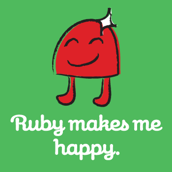
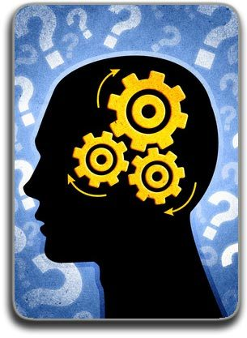

<!--prettier-ignore-start-->
# Course Introduction 
{: .no_toc }

You are an experiment and so is this course. :)

## Table of Contents
{: .no_toc }

1. TOC
{:toc}

<!--prettier-ignore-end-->

## Full Stack Web Development

{:class="small inline"}

In this course I hope to expose you to:

- The Ruby Programming Language
- The Rails Web Programming Framework
- The Windows Subsystem for Linux
- The Git Source Control Tool
- Web Server Configuration & Deployment
- Pair Programming
- CSS Frameworks & Tooling
- Containerization (Docker)
- Moar!

## Why Ruby?

{:class="small inline"}

- Dynamic interpreted languages are gaining popularity (Perl, Python, Javascript, Lua, &c).
- Ruby is free (with a very open license for program distribution)
- Strong programming community (good tutorials, example code, forums, &c)

## Ruby Design Principles

- Principle of Least Surprise
- Principle of Succinctness (a.k.a. Principle of Least Effort)
- Write more understandable code in less lines
- Less code means less bugs
- The quicker we program, the more we accomplish

#### Resources

- [Ruby - A programmers best friend](http://www.ruby-lang.org/en/)
- [Ruby @ Wikipedia](http://en.wikipedia.org/wiki/Ruby_programming_language)
- A brief discussion of [The Principle of Least Surpirse](http://en.wikipedia.org/wiki/Principle_of_least_astonishment)

## Why Rails?

{:class="small inline"}

- Model View Controller (MVC) is becoming the defacto standard for coding web apps.
- Rails code is very DRY (With Rails you **D**on't **R**epeat **Y**ourself)
- Convention over Configuration (Sane defaults but still customizable)
- Open Source with over 3,500 contributors.

_Careful!_ The Rails framework is 'opinionated' meaning that it tries to steer you to code in the 'Rails Way'. If your program becomes overly complex or bogged-down in details, you have drifted from the 'Rails Way'.

#### Resources

- [Ruby on Rails Official Website](http://rubyonrails.org/)

## Who's Using Rails

{:class="large inline"}

These sites were all built on Rails:

- [Shopify](https://www.shopify.ca/)
- [Airbnb](https://www.airbnb.com/)
- [Twitch](https://www.twitch.tv/)
- [SoundCloud](https://soundcloud.com)
- [GitHub](https://github.com/)
- [GitLab](https://gitlab.com/)
- [Hulu](http://www.hulu.com/)
- [Basecamp](https://basecamp.com/)
- [Square](https://squareup.com/)
- [Fun or Die](https://www.funnyordie.com/)
- [Dribble](https://dribbble.com/)
- [Strava](https://strava.com/)
- [Groupon](https://www.groupon.com/)
- [KickStarter](https://www.kickstarter.com/)
- [Indiegogo](https://www.indiegogo.com/)
- [Urban Dictionary](https://www.urbandictionary.com/)
- [Genius](https://www.genius.com)
- [Instacart](https://www.instacart.com/)
- [Bloomberg](https://www.bloomberg.com/)
- [Codecademy](https://www.codecademy.com/)

## Education, Learning and Responsibility

{:class="small inline"}

_"Education is an admirable thing, but it is well to remember from time to time that nothing that is worth knowing can be taught."_ -- Oscar Wilde

**Understanding Requires Action**

If you find yourself falling behind in your understanding of the course material _please_ contact me, or ask a classmate for help. Remember that **you reap what you sow**. If you put minimal effort into this course you will get very little out of it. This means:

- Reading all assigned reading materials.
- Completing (and understanding) all challenges.
- Mastering the Rails / Ruby documentation.
- Typing out Code (No Copypasta)
- Experimentation is better than Stack Overflow and Google-coding
- Permission for Failure / Learning from Mistakes

#### Resources

- [The Secret of Being a Great Apprentice](http://www.skorks.com/2009/09/the-secret-of-being-a-great-apprentice/)
