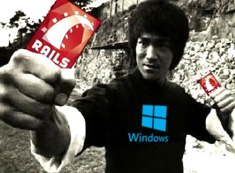

<!--prettier-ignore-start-->
# Windows vs Mac vs Linux 
{: .no_toc }

Professional Rails programmers typically develop their applications using a Mac or Linux based operating system. There is excellent support from the Rails community for both of these platforms.

Historically Windows support for Ruby and Rails was poor, but this is no longer the case. 

## Table of Contents
{: .no_toc .text-delta }  

1. TOC
{:toc}

<!--prettier-ignore-end-->

## Rails and Windows

{:class="small inline"}

In the past, installing both Ruby and Rails under Windows was time-consuming and error-prone.

We're going to avoid these issues by running Rails on a virtualized Linux care of the Windows Subsystem for Linux (WSL2).

## Rails and MacOS

{:class="small inline"}

If you are a Mac user you can skip the first part of this install guide.

Instead you should follow [the instructions listed for your version of MacOS or OSX here](https://gorails.com/setup/osx/).

After this you can scroll down to [the Ruby Editor section](03-installation-steps.html#ruby-editors) of these notes.

If you get an error that mentions "clock_gettime" should should first run the following command from a terminal:

```bash
sudo xcode-select --install
```

## Rails and Linux

{:class="small inline"}

- If you are running Ubuntu, Mint, or another Debian flavour, skip to [the Installing Ruby section](03-installation-steps.html#installing-ruby) of these notes.
- If you're running a non-Debian flavour of Linux you're on your own. I recommend using a Ruby Version Manager like `rbenv` or `rvm` to install Ruby.

If you are running a Debian-flavoured Linux the ruby install instructions should still work for you as they rely on the Debian `apt` package manager.

#### Resources

- [rbenv - Groom your app’s Ruby environment](https://github.com/rbenv/rbenv)
