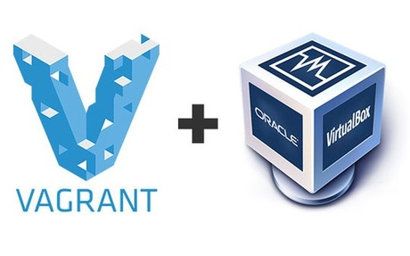

<!--prettier-ignore-start-->
# VirtualBox and Vagrant
{: .no_toc }

**📣 Note:** If everything is working with Ruby on WSL you are now done!

**⚠️ Warning:** Do not follow any more of these instructions unless the WSL didn't work for you.

## Table of Contents
{: .no_toc .text-delta }  

1. TOC
{:toc}

<!--prettier-ignore-end-->

## VirtualBox & Vagrant

{:class="small inline"}

If you couldn't get Ruby running the WSL you will need to install VirtualBox and Vagrant instead.

Download and install:

- [VirtualBox](https://www.virtualbox.org/wiki/Downloads)
- [Vagrant](https://www.vagrantup.com/downloads.html)

VirtualBox should be installed before Vagrant.

Please use all default options during both installations.

## Vagrant Init

We'll work through these instructions together in class.

Start by launching a Windows Terminal. From the terminal:

```bash
cd \
mkdir vagrant-rails
cd vagrant-rails
vagrant init bivee/rails
```

This will generate a `Vangrantfile` in your `vagrant-rails` folder. Open this file and change this line:

```yaml
# config.vm.network "forwarded_port", guest: 80, host: 8080
```

to this:

```yaml
config.vm.network "forwarded_port", guest: 3000, host: 3000
```

_Note that we are both removing a # from the start of the line and modifying guest and host numbers._

## Vagrant Up

The next step is to have Vagrant download and install the virtual Ubuntu Linux machine we'll be using for our Ruby on Rails work.

From your terminal:

```bash
cd \vagrant-rails
vagrant up --provider virtualbox
```

Downloading the VM image may take some time. After this command has finished executing run:

```bash
vagrant ssh
```

This should connect you to the Linux VM command prompt.

## Vagrant Up / Suspend / Halt

To put your Vagrant powered VM to sleep you first need to logout of your Linux command prompt:

```bash
exit
```

And then from the terminal:

```bash
vagrant suspend
```

If you wish to fully shutdown your VM:

```bash
vagrant halt
```

The next time you wish to use the VM:

```bash
vagrant up
vagrant ssh
```

All of these commands put be run from within your `vagrant-rails` folder.

## Installing Rails on your VM

Although Ruby is already installed on your Vagrant VM, Rails is not.

Before you can install Rails you need to be at your VM's command prompt. Using the terminal from your `c:\vagrant-rails` folder:

- Run `vagrant up`, if you haven't already.
- Run `vagrant ssh` to connect to the VM.

You can then install rails with this command:

```bash
gem install rails
```

## Updating Node on your VM

From the vagrant command line:

```bash
sudo apt-get remove nodejs
curl -sL https://deb.nodesource.com/setup_6.x | sudo -E bash -
curl -sS https://dl.yarnpkg.com/debian/pubkey.gpg | sudo apt-key add -
sudo apt-get update
sudo apt-get install nodejs
```

After that, run:

```bash
nodejs -v
```

You should see a reported version of 6.14.4.
