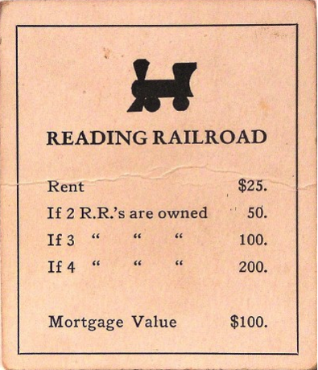
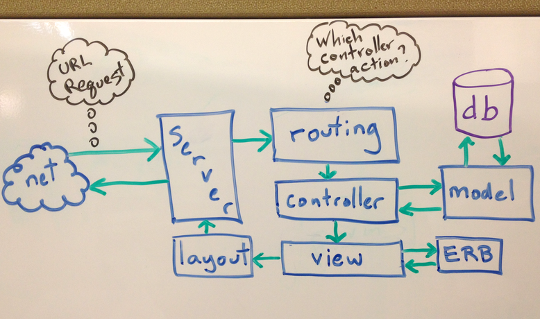
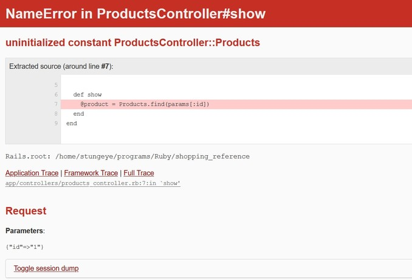

<!--prettier-ignore-start-->
# Rails Tips and Tricks
{: .no_toc }

placeholder.

## Table of Contents
{: .no_toc .text-delta }  

1. TOC
{:toc}

<!--prettier-ignore-end-->

## Ruby on Rails

{:class="small inline"}

Rails is a web application development framework written in the Ruby language.

Rails was designed to make programming web applications easier by making assumptions about what every developer needs to get started.

It allows you to write less code while accomplishing more than many other languages and frameworks.

## Reading Railroad

{:class="small inline"}

If you haven't already, work your way through the [Getting Started with Rails Tutorial](http://guides.rubyonrails.org/getting_started.html) by coding along while you read. This should take an hour of your time and will expose you to the various components of the Rails MVC workflow.

Familarize yourself with the other [Rails Guides](http://guides.rubyonrails.org/) as well as [the Rails API](http://api.rubyonrails.org/).

\* \* \*

_When you have the urge to Google for some Rails coding help, RTFM instead._

**R**ead **T**hese **F**riendly **M**anuals.

#### Resources

- [How to RTFM](https://web.archive.org/web/20130111060652/http://blog.appamatto.com/2011/11/22/how-to-rtfm.html)

## Model View Controller

{:class="small inline"}

### A Rails application flow chart.

**Routing:** The Rails router determines which controller action to execute. We can map specific URLs to controller actions using the /config/routes.rb file.

**Controller:** The controller acts like a bridge between the Model and the View. The controller requests data from the database by way of the Model. Any data that is saved to an instance variable in the controller will be available in the associated view. Each controller is a Ruby class that extends `ActionController::Base`.

**Model:** The model is our ORM (Object Relational Mapper) which allows us to query our database tables using Ruby code rather than SQL. The results from our queries are wrapped in Ruby objects. Most models are Ruby classes that extend `ActiveRecord::Base`.

**View:** The view is the HTML used to display the data gathered by the controller. The view can also contain embedded ruby code (ERB) which is execute on the server.

**Layout:** The layout is a template HTML document within which all views are displayed. The HTML code common to all views is stored in the layout.

_Not shown here is the source of the request, a user's web browser requesting an URL by way of HTTP._

## Creating a New Rails App

Much of our work with Rails happens at the command line. For example, to create a new Rails application we type the following at a command prompt:

`rails new project_name`

Where `project_name` is the actual name of the project we wish to create. Rails will then generate the file/folder structure of an empty Rails project in the current folder.

By default new Rails apps are configured to use SQLite as their database.

## Creating a New Rails App (PostgreSQL)

Since we have Postgres available on our development environment we can ask Rails to use Postgres instead of SQLite when creating a new rails application:

`rails new project_name --database=postgresql`

You'll need to install and configure Postgres either for Windows or within the WSL. You'll also need to set a Postgres username/password and add this user to the `config/database.yml` file like so:

```ruby_on_rails
development:
  <<: *default
  username: your_postgres_user # This line was added.
  password: your_postgres_pass # This line was added.
  database: myapp_development
```

After this we must navigate to the project folder and ask Rails to create the database for us:

`cd project_name`  
`rails db:create`

## The Rails Development Server

To test a Rails application we need to start up a local web server. From the Rails application root folder run the following from the command prompt:

`rails server -b 0 -p 3000`

Or for short:

`rails s`

The `-b` binds the server to any local IP address. This is only important if you are running Rails on a VM.

The `-p` sets the server port to 3000. The default port is 3000.

## Scaffolding a Rails MVC Bundle

We can have Rails generate a Model View Controller bundle for us by describing the data we which to store in our database. For example, to scaffold a products database table:

`rails g scaffold product name:string description:text price:decimal stock_quantity:integer`

If you've gone through the [Getting Started Guide](http://guides.rubyonrails.org/getting_started.html) or the [Rails Blogging Tutorial](http://question.stungeye.com/s5/show/12) notes, you'll know that this command creates all the routes, controllers, migrations, models and views needed to perform CRUD tasks on a specified resource by way of a web browser.

The scaffold command doesn't create the required `products` table in the database. To create that table we need to run:

`rails db:migrate`

## Generating a Controller

To generate an empty controller:

`rails g controller controller_name`

To specific the actions in the controller upfront (and have Rails generated the associated views):

`rails g controller controller_name action1 action2 action3`

Where action1, 2 and 3 are the names of actions you want to include in your controller.

## Generating a Model

Generating a model is similar to generated a scaffold, except only the model and the migration in built:

`rails g model product name:string description:text price:decimal stock_quantity:integer`

Remember that when generating either a scaffold or a model you also have to prepare the database by running:

`rails db:migrate`

## Removing Generated "Things"

But what if you want to remove a generated scaffold, model, or controller?

If you've been diligent with your git commits and your branching you can rollback the changes using version control.

You can also remove generated "things" using the `rails destroy` command:

```ruby_on_rails
rails d scaffold Product
rails d model Product
rails d controller products

```

## ActiveRecord

From the [ActiveRecord Rails Guide](https://guides.rubyonrails.org/active_record_basics.html):

"Active Record is the M in MVC - the model - which is the layer of the system responsible for representing business data and logic.

Active Record facilitates the creation and use of business objects whose data requires persistent storage to a database."

ActiveRecord Resource:

- Our ["course notes" on using ActiveRecord](https://github.com/stungeye/ActiveRecord-without-Rails) show how to perform CRUD operations on your database tables, and how AR deals with one-to-many associations between models.
- [Active Record Query Interface Guide](http://guides.rubyonrails.org/active_record_querying.html)
- [Active Record Validations](https://guides.rubyonrails.org/active_record_validations.html)
- [Active Record Associations](http://guides.rubyonrails.org/association_basics.html)

## Rails Migrations (Add Column)

Rails Migrations allow us to make incremental changes to our Models.

To add an image property (type string) to [the demonstration blog app](https://github.com/StungEye-RRC/Rails-Manual-Blog), we ran the following migration generator from the command line:

`rails g migration add_image_to_products image:string`

The naming here is important. Whenever we want to add a new column to a table the command follows this form:

`rails g migration add_column_to_table column:type`

(Where `column` in the name of the column to add, `table` is the name of the table to be modified, and `type` is the database of this column.)

The first migration command above would generate a migration in the `db/migrate` folder called `20121107184925_add_image_to_products.rb`:

```ruby_on_rails
class AddImageUrlToProducts < ActiveRecord::Migration
  def change
    add_column :products, :image, :string
  end
end
```

Next we use the rails command to run the migration:

`rails db:migrate`

**NOTE:** If we want a newly added column to be set-able from a view form, it must be added to the `attr_accessible` list in the associated model.

## Rails Migrations (Remove Column)

We can also use migrations to rename columns, remove columns, add indexes, etc.

For example, to remove a String column named `image` from the `products` table:

`rails g migration remove_image_from_products image:string`

#### Resources

To best understand all that can be accomplished with migrations please read the [Rails Guides page on Migrations](http://guides.rubyonrails.org/migrations.html).

## Configuring Routes

Routes are how our Rails application turns the URLs it receives into calls to a Controller action. Routes are configured in the `config/routes.rb` file.

If, for example, we are building routes for a Products controller and we want [all seven CRUD routes](http://guides.rubyonrails.org/routing.html#crud-verbs-and-actions) we need only add:

```ruby_on_rails
resources :products
```

If we only wanted the `index` and `show` routes:

```ruby_on_rails
resources :products, only: [:index, :show]
```

We can also manually generate routes by following this pattern:

```ruby_on_rails
httpverb 'url/path' => 'controller#action', as: 'named_route'
```

So to generate the `index` route for a products controller:

```ruby_on_rails
get 'products' => 'products#index', as: 'products'
```

If we want to generate a member route (one that makes reference to a specific product by id) like `show`:

```ruby_on_rails
get 'products/:id' => 'products#show', as: 'product', id: /\d+/
```

Member routes like this contain placeholders (in this case :id, which is constrained to a number with the regular express at the end). The actual id sent via the URL will be accessible in the controller action via the `params` hash. So the products `show` action might look like this:

```ruby_on_rails
def show # Within the products controller
  @product = Product.find(params[:id]) # Find the product with the primary key mentioned in the URL.
end
```

## Setting the Root Route

In the Rails routing file (`config/routes.rb`) we can specify which controller action to execute when our users visit the root of our domain.

For example, to set the `products` controller's `index` action as the domain root:

```ruby_on_rails
root to: 'products#index'
```

When using our development server we can invoke this route by visiting [http://localhost:3000/](http://localhost:3000)

**Important:** In order for this route to work properly, the `index.html` file in the `public` folder must be deleted.

#### Resources

- [Rails Routing Guide](http://guides.rubyonrails.org/routing.html)

## The link_to Helper

Once you have routes in place you may want to link to these routes from a view. We use the `link_to` helper to build our links in Rails.

Linking to some of the routes defined above:

```ruby_on_rails
# Links to the "products" route:
<%= link_to 'All Products', products_path %>

# Links to the "product" route, given a Product variable named "product":
<%= link_to product.name, product %>

# Links to the root route:
<%= link_to 'Home', root_path %>
```

## Rails View Partials

Partials are a device for breaking the view rendering process into more manageable chunks. With a partial, you can move the code for rendering a particular view to its own file. This allows us to keep our view code DRY.

Render the `_menu.html.erb` file found in the current folder:

```ruby_on_rails
<%= render 'menu' %>
```

This is a short-cut for:

```ruby_on_rails
<%= render partial: 'menu' %>
```

If the `_menu.html.erb` file isn't in the current folder, for example the `app/view/shared` folder:

```ruby_on_rails
<%= render 'shared/menu' %>
```

**NOTE:** Partial filenames must always begin with an underscore, but we don't use the underscores in the `render` arguments.

## Rendering Partials for Objects or Collections

Given a @product variable that contains a Product object render a `_product.html.erb` file found in the products view folder.

```ruby_on_rails
<%= render @product %>
```

Given a collection of Product objects in @products render the `views/products/_product.html.erb` once for each Product.

```ruby_on_rails
<%= render @products %>
```

These are shortened forms for the fully expanded calls to the render command. The first of these is equivalent to:

```ruby_on_rails
<%= render partial: 'product', object: @product %>
```

The second is equivalent to:

```ruby_on_rails
<%= render partial: 'product', collection: @products %>
```

#### Resources

Rails partials have a lot more to offer, including local variables. Be sure to read through:

- [View Partials](http://guides.rubyonrails.org/layouts_and_rendering.html#using-partials) from the Layouts and Rendering Rails Guide.

## Displaying Images

The image_tag helper builds an HTML `` tag for the specified file. By default, files are loaded from `app/assets/images`.

To display the `app/assets/images/fish.png` image:

```ruby_on_rails
<%= image_tag "fish.png" %>
```

We can also any of the `img` tag attributes using symbols:

```ruby_on_rails
<%= image_tag "fish.png", , :width ='20%' %>
```

This would generate:

```ruby_on_rails

```

For model objects that include an image string property (like in our [blog app](https://github.com/StungEye-RRC/Rails-Manual-Blog)) we display the image within a view like this:

```ruby_on_rails
<%= image_tag @product.image %>
```

Assuming that `@product` is a `Product` model object from our blog.

## Working With Model Forms

We can use the `form_with` helper to bind a form to a model object.

Imagine a controller where the `new` and `edit` actions load a `Post` object into a `@post` variable. In the view, we could build a form bound to the `Post` model object:

```ruby_on_rails
<%= form_with(model: @post, local:true) do |f| %>
  <div>
      <%= f.label :title %><br/>
      <%= f.text_field :title %>
  </div>
  <div>
    <%= f.label :body %><br/>
    <%= f.text_area :body %>
  </div>
  <div>
    <%= f.label :image %><br/>
    <%= f.text_field :image %>
  </div>
  <%= f.submit %>
<% end %>
```

The `f` block argument is a form builder. We use it to build the various components of our form.

For example, this code:

```ruby_on_rails
<%= f.label :image %>
<%= f.text_field :image %>
```

Would generate these html form tags, associated with the `Post` object's `image` property.

```ruby_on_rails
<label for="post_image">Image</label>
<input id="post_image" name="post[image]" size="30" type="text" value="" />
```

#### Resources

More information on dealing with generic forms, or model-centric forms read the [Form Helper Rails Guide](http://guides.rubyonrails.org/form_helpers.html#dealing-with-model-objects).

## Model Forms with Associations

Rails makes it easy to associate one model with another by way of a foreign key. In our CRM example the customer model had a `province_id` property. To link the two models:

in `app\models\customer.rb`:

```ruby_on_rails
belongs_to :province
```

in `app\models\province.rb`:

```ruby_on_rails
has_many :customers
```

Then within the customers `_form` partial:

```ruby_on_rails
<div class="field">
  <%= f.label :province_id %><br />
  <%= f.collection_select :province_id, @provinces, :id, :name %>
</div>
```

This view code assumes that the `@provinces` instance variable contains a collection of all the Province objects from the provinces table. This instance variable would have to be added to any controller actions using this `_form` partial.

It also assumes that Province objects have a `name` property containing the name of the province.

## Implementing a Keyword Search

An implementation of a keyword search can be seen in this [Simple Store example](https://github.com/StungEye-RRC/ecomm-ftw-89443). Specifically:

- The `search` and `search_results` actions in [the storecontroller](https://github.com/StungEye-RRC/ecomm-ftw-89443/blob/master/app/controllers/store_controller.rb).
- [The associated routes](https://github.com/StungEye-RRC/ecomm-ftw-89443/blob/master/config/routes.rb).
- [The `search.html.erb` view form](https://github.com/StungEye-RRC/ecomm-ftw-89443/blob/master/app/views/store/search.html.erb) and [the `search_results.html.erb`](https://github.com/StungEye-RRC/ecomm-ftw-89443/blob/master/app/views/store/search_results.html.erb).

**Note:** This example Rails app uses an older version of Rails, but the search code linked to above should still be valid

#### Resources

Details on building forms using `form_tag` and the associated helpers can be found in [the Form Helper guide](http://guides.rubyonrails.org/form_helpers.html).

## Select Dropdowns with form_tag

The `f.collection_select` helper works nicely with `form_for`, but sometimes you want to build a select dropbox for use with a `form_tag`. For this we use a combination of `select_tag` and `options_for_select`.

```ruby_on_rails
<%= form_tag some_route_path do %>
   <%= select_tag :my_option, options_for_select(@some_array) %>
   <%= submit_tag "Search" %>
<% end %>
```

When this form is submitted the option selected by the user in the select dropdown will be found in `params[:my_option]`.

The `@some_array` variable should be an array of strings to use as options for the select dropdown.

If your options are coming from an ActiveRecord collection, you can use the `options_from_collection_for_select` helper. The added benefit of this helper is that the `value` attributes of each `option` tag can be made to contain the ActiveRecord `id` of the collection members.

So for example, if you had an `@categories` collection of `Category` objects where each category had a `name`:

```ruby_on_rails
<%= select_tag :category, options_from_collection_for_select(@categories, 'id', 'name') %>
```

On submission of the form the selected category id could be found in `params[:category]`.

#### Resources

- [Rails API: options_for_select](http://api.rubyonrails.org/classes/ActionView/Helpers/FormOptionsHelper.html#method-i-options_for_select)
- [Rails API: options_from_collection_for_select](http://api.rubyonrails.org/classes/ActionView/Helpers/FormOptionsHelper.html#method-i-options_from_collection_for_select)
- [Rails Guide: The Select and Option Tags](http://guides.rubyonrails.org/form_helpers.html#the-select-and-option-tags)

## Persistence with Session

HTTP, the protocol used for communication between web-servers and web-browsers is stateless. By this I mean that a web-server does not retain information about the user/browser between requests.

In the context of Rails this means that variables cannot retain their values between requests. All variables loose scope after a view is rendered.

Sessions were created to allow for data persistence across browser requests. In Rails, a session is a hash-like structure that allows a web-server to store and then restore objects across requests. Rails associates these persisted objects with specific users/browsers.

To allow us to persistent data cross browser request, Rails provides a special `session` hash.

#### Resources

- [Rails Guide on Session](http://guides.rubyonrails.org/action_controller_overview.html#session)

## Session Example

Imagine a controller action called `remember_me`:

```ruby_on_rails
def remember_me
  if session[:count].nil?
    session[:count] = 1
  else
    session[:count] += 1
  end
  @count = session[:count]
end
```

Each time this action is executed the `@count` will increase by one. Session is tied to a specific browser by way of a browser cookie. This means that a separate count will be maintained for each user that executes this action.

## Controller Before Filters

Before filters are methods that are run before a controller action. Here's some example code.

```ruby_on_rails
class SomeController < ApplicationController
  # Run some_method before all actions:
  before_action :some_method

  # Run method_name before the index and show actions:
  before_action :method_name, only: [:index, :show]

  # Run another_method before all actions except those shown:
  before_action :another_method, except: [:edit, :update]

  # The rest of the controller actions have been omitted.
end
```

Note that `some_method`, `method_name` and `another_method` must be defined within this controller, or within the ApplicationController.rb file. All controllers inherit the methods added to the ApplicationController.

#### Resources

- [Before Filters](http://guides.rubyonrails.org/action_controller_overview.html#filters) - Rails Controller Guide

## Single User HTTP Authentication

Simple username/password protection can be added to a Rails project using HTTP digest authentication. In the application_controller.rb you need to add the following within the class definition:

```ruby_on_rails
private
USERS = { "admin" => "gorgonzola7!" }
def require_sudo
  authenticate_or_request_with_http_digest do |username|
    USERS[username]
  end
end
```

We can then use a before filter to protect all (or a subset of) any controller's actions from within that controller:

```ruby_on_rails
before_action :require_sudo, only: [:update, :create, :destroy]
```

#### Resources

- [HTTP Authentication Further Simplified](http://guides.rubyonrails.org/action_controller_overview.html#http-authentications)

## Debugging with Rails

{:class="small inline"}

When something goes wrong with your Rails application it can sometimes be hard to know where to look to debug the problem.

To start, a careful reading of the information displayed in the browser will show you:

- The error type (in the header).
- The file where the error occurred.
- The line within that file where the error occurred.
- The error description (above the source extract).
- The contents of the `params` hash (in the Parameters section).
- The contents of the `session` hash (in toggle session dump).

**Note:** Sometimes Rails will indicate that the error occurred in a View, but the error description will reference SQL. This means you should look to the controller action associated with the View triggering the error.

#### Resources

- [Rails Guide on Debugging](http://guides.rubyonrails.org/debugging_rails_applications.html)

## Debugging Rails with the Web Console

{:class="small inline"}

When Rails is in development mode it will supply you with an interactive Ruby console in your web browser when it encounters an error.

The next time you get a Rails error try typing Ruby code into the web console. You can access your Active Record models from this console too.

### Console Breakpoints

You can also use the web console as a way to put debugging breakpoints into your code.

For example, in a controller action you could trigger the web console like this:

```ruby_on_rails
def show
  @product = Product.find(params[:id])
  console # Trigger the web console for debugging.
end
```

And then within the web console you could inspect the state:

```ruby_on_rails
>> @product <enter>
=> #<Product id: 13, name: "Heavy Duty Wooden Keyboard", price_cents: 84289, description: "Error quisquam temporibus pariatur fugiat nemo num...", created_at: "2020-11-23 17:22:55", updated_at: "2020-11-23 17:45:50">
>> params[:id] <enter>
=> "13"
>>
```

#### Resources

- [Rails Guides: Debugging With The Web Console](https://guides.rubyonrails.org/debugging_rails_applications.html#debugging-with-the-web-console-gem)

## Debugging with Debug

When debugging a view file you will sometimes wish to inspect the contents of a variable. The `debug` helper lets you do this:

```ruby_on_rails
<%= debug @object_you_wish_to_debug %>
```

Now when you load this view in your browser, you will see the contents of your object. For ActiveRecord object you will be shown all the object properties. For Arrays you will be shown the contents of all the objects in the Array.

If your debug output look like this:

`- []`

That means you are attempting to view an empty array.

## Debugging with the Logger

When debugging a controller you may also wish to inspect the contents of your variables. The easiest way to do this is to print strings to the `rails s` server output in the console.

To write to the server logs from your controller:

```ruby_on_rails
logger.debug("This is a debugging message.")
```

You can also interpolate variables into your log messages:

```ruby_on_rails
logger.debug("The query returned #{@products.size} posts.")
```

(Assuming `@products` is a collection of Product objects.)
