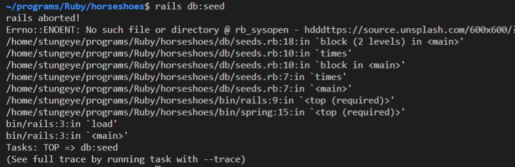
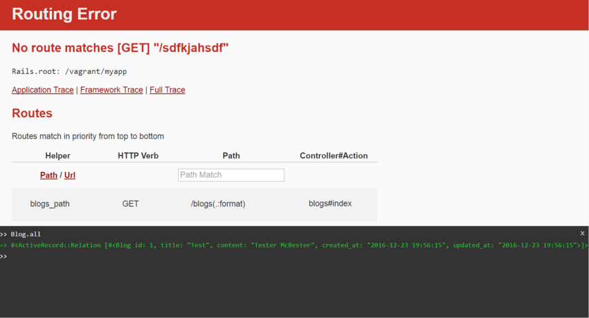
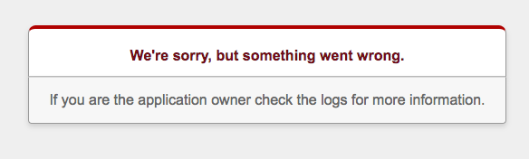

<!--prettier-ignore-start-->
# Debugging a Rails App
{: .no_toc }

When something goes wrong with your Rails application it can be hard to know how to start debugging the problem, unless you know where to look.

### Table of Contents
{: .no_toc }

1. TOC
{:toc}

<!--prettier-ignore-end-->

## Ruby Script Errors Produce Stack Traces

You might run into errors with Ruby scripts like your Rails seed file. When an error occurs in a script a "stack trace" is printed to the terminal. The most important information appears at the bottom and the top of the long stack trace.



### Debugging a Stack Trace

- Look at the bottom and the top of the stack trace for mentions of files you wrote yourself.
- Ignore lines that mention files in gems or parts of Rails you don't control.
- Printed after each filename will be a colon and then line number.
- Beyond all these filenames the stack trace will also contain the actual error message.
- Investigate the file and line mentioned closest to the error message.

In the above image a file error occured on **line 18** of the `/db/seeds.rb` file.

## Debugging a Rails Error

{:class="small inline"}

To start, a careful reading of the information displayed in the browser will show you:

- The error type (in the header).
- The file where the error occurred.
- The line within that file where the error occurred.
- The error description (above the source extract).
- The contents of the `params` hash (in the Parameters section).
- The contents of the `session` hash (in toggle session dump).

**Note:** Sometimes Rails will indicate that the error occurred in a View, but the error description will reference SQL. This means you should look to the controller action associated with the View triggering the error.

#### Resources

- [Rails Guide on Debugging](http://guides.rubyonrails.org/debugging_rails_applications.html)

## Debugging Rails with the Web Console

{:class="small inline"}

When Rails is in development mode it will supply you with an interactive Ruby console in your web browser when it encounters an error.

The next time you get a Rails error try typing Ruby code into the web console. You can access your Active Record models from this console too.

### Console Breakpoints

You can also use the web console as a way to put debugging breakpoints into your code.

For example, in a controller action you could trigger the web console like this:

```ruby
def show
  @product = Product.find(params[:id])
  console # Trigger the web console for debugging.
end
```

And then within the web console you could inspect the state:

```ruby
>> @product <enter>
=> #<Product id: 13, name: "Heavy Duty Wooden Keyboard", price_cents: 84289, description: "Error quisquam temporibus pariatur fugiat nemo num...", created_at: "2020-11-23 17:22:55", updated_at: "2020-11-23 17:45:50">
>> params[:id] <enter>
=> "13"
>>
```

#### Resources

- [Rails Guides: Debugging With The Web Console](https://guides.rubyonrails.org/debugging_rails_applications.html#debugging-with-the-web-console-gem)

## Debugging in Rails Views with Debug

When debugging a view file you will sometimes wish to inspect the contents of a variable. The `debug` helper lets you do this:

```erb
<%= debug @object_you_wish_to_debug %>
```

Now when you load this view in your browser, you will see the contents of your object. For ActiveRecord object you will be shown all the object properties. For Arrays you will be shown the contents of all the objects in the Array.

If your debug output look like this:

`- []`

That means you are attempting to view an empty array.

## Debugging with the Logger

When debugging a controller you may also wish to inspect the contents of your variables. The easiest way to do this is to print strings to the `rails s` server output in the console.

To write to the server logs from your controller:

```ruby
logger.debug("This is a debugging message.")
```

You can also interpolate variables into your log messages:

```ruby
logger.debug("The query returned #{@products.size} posts.")
```

(Assuming `@products` is a collection of Product objects.)

## 500 Errors Mean: Check Your Logs



Once a Rails application has been deployed to a server it becomes harder to debug.

When running in "production mode" all server-side errors result in the same cryptic error message: "We’re sorry, but something went wrong."

This message will be delivered to your browser with a HTTP status code of 500.

This is your cue to look at the log file. The production log file can be found here:

`logs/production.log`

On Heroku you can use the Heroku CLI to view the logs:

`heroku logs`
