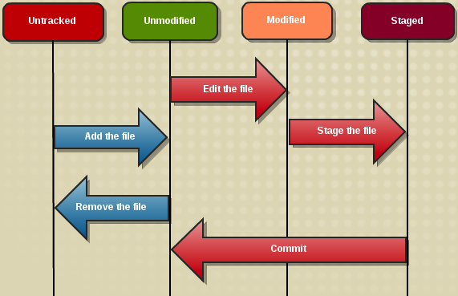

<!--prettier-ignore-start-->
#  Git Overview
{: .no_toc }

Version control, also known as revision control or source control, is the management of changes to documents like computer programs.

This is a module on the git version control tool.

## Table of Contents
{: .no_toc }

1. TOC
{:toc}

<!--prettier-ignore-end-->

## Ctrl-Z to Undo

Have you ever used CTRL-Z to undo a change you've made in a file?

CTRL-Z lets us undo one or more changes in files we have open, but it has it's limitation.

- What if you wanted to undo a change to a file you made weeks ago?

- What if you wanted to undo a change made to a file by someone else?

- What if you wanted to experiment with a series of changes and then revert back to a specific version of the file?

## Version Control

**Version control**, also known as **revision control** or **source control**, is the management of changes to documents like computer programs.

CTRL-Z is the simplest form of version control.

Some documents have more advanced version control built in. For example:

- Microsoft Word has a "Track Changes" feature.
- Google Docs automatically tracks file changes over.
- You can see the edit history of all Wikipedia articles.  
  ([Here's the history of the version control article](https://en.wikipedia.org/w/index.php?title=Version_control&action=history).)

## More Than Just Undo

Version control allows for more than just undoing things.

You can use version control to:

- Work on new projects features while at the same time patching bugs found in older version of the code.

- Collaborate with someone on a projects without overwriting each other's work.

- Work with distributed teams of coders from around the world to develop open-source applications.

## Version Control with Git

Git is a free and open source distributed version control system.

Git helps us keep track of the changes to our source code over the lifespan of a project.

<iframe width="560" height="315" src="https://www.youtube.com/embed/8oRjP8yj2Wo?list=PLg7s6cbtAD165JTRsXh8ofwRw0PqUnkVH" frameborder="0" allowfullscreen="allowfullscreen"> </iframe>

Other videos in this series:

- **Part Two** [What is Git](https://www.youtube.com/watch?v=uhtzxPU7Bz0&list=PLg7s6cbtAD165JTRsXh8ofwRw0PqUnkVH) (8 minutes)
- **Part Three** [Getting Going](https://www.youtube.com/watch?v=wmnSyrRBKTw&list=PLg7s6cbtAD165JTRsXh8ofwRw0PqUnkVH) (4.5 minutes)
- **Part Four** [Quick Wins with Git](https://www.youtube.com/watch?v=7w5Z7LmyLgI&list=PLg7s6cbtAD165JTRsXh8ofwRw0PqUnkVH) (5 minutes)

#### Resources

A few git resources:

- [GitHub For Beginners: Don't Get Scared, Get Started](http://readwrite.com/2013/09/30/understanding-github-a-journey-for-beginners-part-1#awesm=~oj8fkvhuiDnYWz)
- [Git - The Simple Guide](http://rogerdudler.github.com/git-guide/)
- [Git CheetSheet](https://services.github.com/on-demand/downloads/github-git-cheat-sheet.pdf)
- [Pro Git Ebook](http://git-scm.com/book)

## Fancy Version Control Words

When discussing version control you'll need to know the definition of the following terms:

- **CLI** - Command Line Interface. The "Terminal" or "Shell" of your operating system. Git is a CLI tool but there are also graphical (GUI) interfaces.

- **Respository** - A collection of files and directories you are monitoring for changes using a version control tool. Sometimes shortened to **repo**.

- **Hash** - A string of characters that acts like a digital fingerprint for a file or portion of a file. The type of hash used by git is [the SHA1 cryptographic hash](https://en.wikipedia.org/wiki/SHA-1).

- **Graph** - A diagram of nodes connected by lines called edges. (See image below.)

- **DAG** - Directed Acyclic Graph. A graph were the edges are arrows (directed) and no matter which arrow you follow you can never travel in a circle (acyclic).

Here's an example image of a Directed Acyclic Graph:

## Initializing a Repository

To bring a new project **under control** we must first initialize the repository (the repo) from within the project's root folder:

To **init**ialize a new git repo from the command prompt:

`git init .`

To check the **status** of the repo for changes or additions:

`git status`

To compare the **diff**erences between the current files and the last commit:

`git diff`

## Change Management with Git

{:class="medium"}

As we make changes to our source code we need to **commit** these changes to our git repository.

Before we can **commit** we must **add** new or changed files to a staging area:

`git add path\to\file.name`

Using a period to **add** all new or modified files:

`git add .`

Wilcards work too:

`git add "*.rb"`

**Commit**ting your staged changes with a commit message:

`git commit -m "Your explanation of the changes goes here."`

## Git Commits and the Git Log

{:class="small"}

A repo's commits can be reviewed by running:

`git log`

Each entry in the log shows:

- The commit hash.
- Who made the commit.
- When it was made.
- The commit message.

The image to the right shows two entries from a git log. The 40 character hex numbers shown at the start of each entry are the SHA1 hashes that uniquely identify each commit.

## Branching

{:class="large inline"}

Branches in git give you a safe space to work on new features. The main branch of your repository is called the master branch.

Commits made in other branches can be merged into the master at any time. Branches can also be abandoned or even deleted at any time leaving the master unchanged.

To create a new branch: `git checkout -b new-branch-name`

To switch branch: `git checkout name-of-branch`

To merge change into the active branch: `git merge branch-to-merge`

To delete a branch: `git branch -d branch-to-delete`

#### Resources

- Git likely uses the term "master" in [the context of "master copy" or "master recording"](https://git.github.io/rev_news/2020/07/29/edition-65/) but you can [easily rename your Git default branch from master to main](https://www.hanselman.com/blog/EasilyRenameYourGitDefaultBranchFromMasterToMain.aspx) if you wish to.

## Distributed Versioning with Github

To save your git repository to your GitHub account, create a new repository by way of the "create a new repo" button in the top corner of the GitHub website.

**IMPORTANT**: Be sure _not_ to click the checkbox to initialize with a README or with any other files.

{:class="medium"}

Let's say you've created a new repo called "rails_project" and you've already initialized this project's git repository.

From the command line (within your project folder) add Github as a remote:

`git remote add origin git@github.com:<username>/rails_project.git`

_This should be all one line with `<username>` replaced by your actual username._

When ever you want to push the latest state of your repo to Github:

`git push origin master`

## Undoing Things in Git

{:class="large inline"}

In Git, undo can mean a few different things depending on what you wish to undo.

Learn more about undoing with git:

- [Undoing Changes wit Git](https://www.atlassian.com/git/tutorials/undoing-changes/git-clean)
- [How to undo (almost) anything with Git](https://github.com/blog/2019-how-to-undo-almost-anything-with-git)
- [On undoing, fixing, or removing commits](http://sethrobertson.github.io/GitFixUm/fixup.html) - A git "choose your own adventure"!
